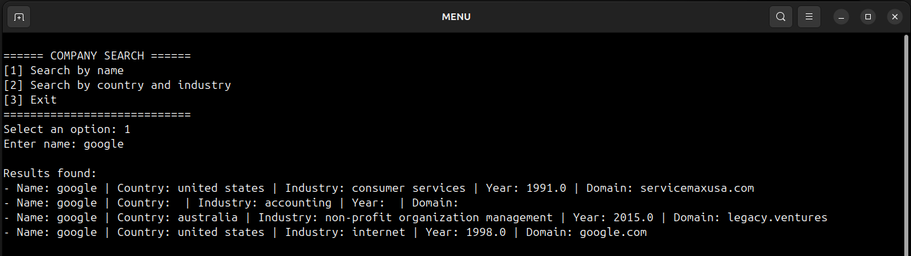
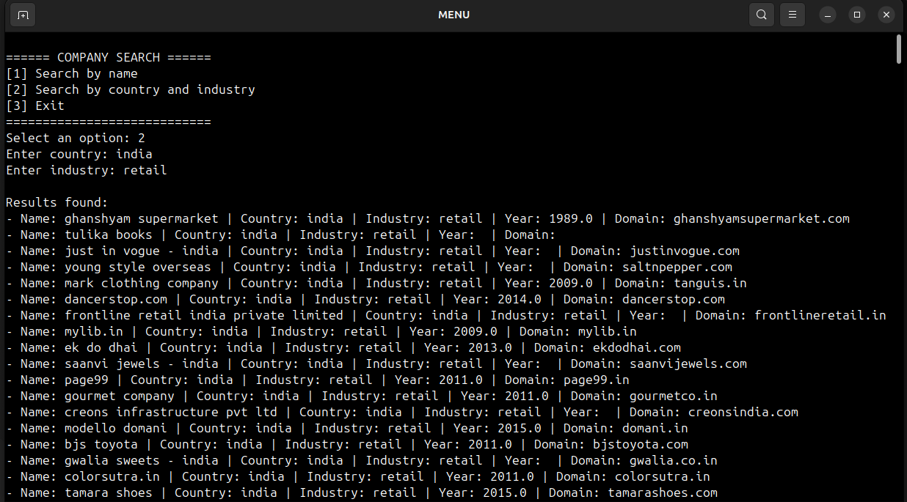

# Práctica 1: Procesos y comunicación entre procesos

## Integrantes

- Yadixon David Alfonso Chiquillo ([yalfonsoc@unal.edu.co](mailto:yalfonsoc@unal.edu.co))
- Federico Puentes Acosta ([fpuentesa@unal.edu.co](mailto:fpuentesa@unal.edu.co))
- Juan Camilo Vergara Tao ([juvergarat@unal.edu.co](mailto:juvergarat@unal.edu.co))


## Enunciado

[Práctica 1](https://capedrazab.github.io/material_cursos/20261/os/practica1.pdf)


## Dataset

El dataset utilizado contiene información de más de **7 millones de empresas** vinculadas a LinkedIn a nivel global. El archivo original en formato CSV (`companies_sorted.csv`) tiene un tamaño aproximado de **1.09 GB**.

Enlace de descarga: [Kaggle: 7+ Million Company Dataset](https://www.kaggle.com/datasets/peopledatalabssf/free-7-million-company-dataset?resource=download)

### Campos del Dataset

| # | Campo | Tipo | Descripción |
|---|-------|------|-------------|
| 1 | # | int | Identificador de la empresa en el dataset. |
| 2 | name | string | Nombre de la empresa. |
| 3 | domain | string | Dominio web de la empresa. |
| 4 | year founded | int | Año de creación. |
| 5 | industry | string | Industria o sector económico al que pertenece la empresa. |
| 6 | size range | string | Rango de empleados definido por la cantidad total de empleados. |
| 7 | locality | string | Ubicación de la empresa incluyendo ciudad, estado y país. |
| 8 | country | string | País donde se ubica la empresa. |
| 9 | linkedIn url | string | URL de LinkedIn asociado con la empresa. |
| 10 | current employee estimate | int | Número de empleados actuales de la empresa. |
| 11 | total employee estimate | int | Número total de empleados de la empresa. |


## Implementación Técnica

### Criterios de Búsqueda

Se implementaron dos criterios de búsqueda:

1. **Búsqueda por nombre:** Se implementó mediante una tabla hash de 500,000 entradas para garantizar búsquedas en tiempo constante $O(1)$.

2. **Búsqueda por país e industria:** Se utiliza una llave compuesta (país e industria) indexada en una segunda tabla hash dedicada, con 500,000 entradas.

### Justificación

Se implementaron dos criterios de búsqueda separados para permitirle al usuario buscar una empresa en específico (por su nombre) o buscar empresas que pertenezcan a cierto sector económico en un país de su interés (por país e inudstria).

El dataset tiene 7,004,635 valores únicos para los nombres de las empresas, los cual permite al usuario encontrar fácilmente una empresa (o empresas que compartan el nombre) con conocer esta información, y añadir el país o la industria en la búsqueda no permite filtrar más allá; sin embargo, si un usuario desea conocer empresas que compartan el mismo sector económico y se ubiquen en el mismo país puede encontrar esta información con el segundo criterio de búsqueda, el cual ofrece usualmente más de un resultado (varias empresas) por búsqueda.

### Adaptaciones de Rendimiento

- **Indexación Binaria:** El CSV se transforma en un archivo `data.bin` de registros fijos (90 bytes por campo). Esto permite usar `fseek()` para saltar directamente al registro sin leer el archivo secuencialmente.

- **Gestión de Memoria:** Los índices en RAM ocupan exactamente **8MB** (4MB por tabla), cumpliendo con la restricción de **< 10MB** impuesta en la práctica.
- **Comunicación (IPC):** Se utilizan dos tuberías nombradas (**FIFOs**) para la comunicación bidireccional entre el proceso de interfaz (`p1-dataProgram`) y elbBuscador (`searcher`).


## Instrucciones de Uso

### Requisitos
1. Tener instalado `gcc` y `make`.
2. Descargar el dataset `companies.csv` y ubicarlo en `data/companies_sorted.csv`.

### Compilación
En la raíz del proyecto, ejecute:
```bash
make
```

### Ejecución Automática

> [!WARNING]
> ¡Se debe ejecutar al menos una vez para indexar el dataset y crear las tuberías!

Este proceso ejecuta todo el programa en el orden necesario y abre dos terminales con los procesos: interfaz y buscador.
```bash
./p1-dataProgram
```

### Ejecución Manual

Después de haber ejecutado al menos una vez `p1-dataProgram` se pueden ejecutar los dos procesos de manera manual.

#### Interfaz

Este proceso abre la interfaz de usuario en la terminal.
```bash
./bin/p1-dataProgram
```

#### Buscador

Este proceso realiza las búsquedas solicitadas y hace un registro impreso en consola.
```bash
./bin/searcher
```
Para realizar búsquedas siga las instrucciones en pantalla del menú.


### Rangos Válidos de Búsqueda

- **Nombres, países e industrias:** Cadenas alfabéticas (a-z) en minúsculas. Los nombres de los países e industrias deben estar escritos en inglés.

- **Opciones de menú:** Valores numéricos (1, 2 o 3 según corresponda).


### Ejemplos de Uso

- **Búsqueda por nombre:** Seleccionar opción `1`, ingresar `google`. El sistema retornará toda la información relacionada a Google presente en el dataset, que corresponde a 4 resultados.

    

- **Búsqueda por país e industria:** Seleccionar opción `2`, escribir para el país `india` y para la industria `retail`. Retornará todas las empresas que coincidan con ambos filtros simultáneamente, obteniéndose la información de 1491 empresas.

    